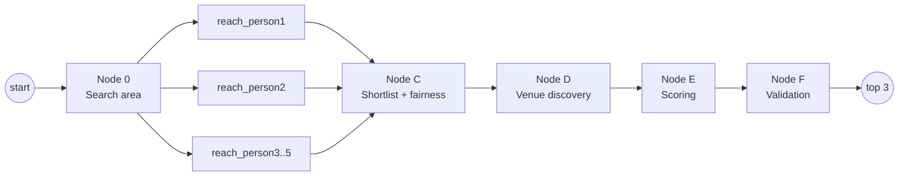

# Methodology

How Not-So-Mid-Point decides where a group of two to five people should meet.

The short version: it never computes a geographic midpoint. It samples real
places, asks Google what each person's journey to each of them actually costs,
and then optimises an explicit objective over the survivors. Every number the
interface shows is traceable to one of the formulas below.

---

## 1. Why not a midpoint?

The obvious algorithm, averaging the two coordinates and searching near the
result, fails in three specific ways:

1. **The midpoint may be unreachable.** Between Ballard and Columbia City in
   Seattle, the geographic midpoint lands near the water and industrial rail
   yards, with no useful transit connection from either side.
2. **It ignores asymmetric transport.** Transit networks are radial. Two people
   equidistant from a point can have wildly different journeys to it: one on a
   direct line, one making two transfers.
3. **It optimises nothing.** "Halfway" is not the same as "fair", and neither is
   the same as "somewhere we both want to be".

So the system treats this as a constrained optimisation over sampled candidates,
with travel cost measured by routing APIs rather than by distance.

---

## 2. Architecture

Six specialised nodes in a directed graph (LangGraph), with state accumulating
as it flows:



The reachability nodes are the reason this is a graph rather than a loop: they
are independent, IO-bound, and run in the same superstep. There is a **static
node per party slot** (five, `MAX_PARTIES`) rather than one looping node, so the
parallelism stays genuine no matter how many people are involved. A slot with
nobody in it returns immediately and costs nothing.

Each writes only its own index into `reachability`, a dict carrying a union
reducer, so concurrent writes merge rather than race. `warnings` and `timings`
carry commutative reducers for the same reason.

Any node may set `failure` and short-circuit the rest. Downstream nodes check it
and return immediately, so a failed run still emerges with a well-formed state
object rather than missing keys.

---

## 3. Node 0: the transit-aware search area

**Goal:** find the zone where both people's travel costs are balanced *and* low,
without spending a routing call on every neighbourhood in the city.

### 3.1 Candidate generation

With more than two parties the corridor is anchored on the **two people furthest
apart**. Everyone else falls inside that span, so it remains the widest
meaningful search band.

Candidates are drawn from a seeded list of ~50 Seattle-area neighbourhood
centroids, not from a geometric grid. A grid point can land in Lake Washington;
a neighbourhood centroid is somewhere transit serves and venues exist.

Two filters define the corridor between the two people:

- **Perpendicular band.** Distance from the P1→P2 segment ≤ `corridor_half_width_km`
  (default 4 km), computed with a local equirectangular projection. This keeps
  the search a corridor rather than a disc.
- **Ellipse.** `d(c,P1) + d(c,P2) ≤ max(1.5 · d(P1,P2), 6 km)`. Without this,
  the perpendicular band extends infinitely past both endpoints and would admit
  neighbourhoods behind each person.

Survivors are sorted by distance from the straight-line midpoint and the nearest
`SWEEP_LIMIT` (16) are kept. Outside the seeded bounding box the system falls
back to a generated 5×3 corridor grid plus reverse geocoding, so it is not
Seattle-only. Seattle is just where it has good priors.

### 3.2 The balance sweep

One **Distance Matrix** request per person, each covering all 16 candidates at
once, all issued concurrently. This is a deliberate departure from the obvious choice of
Directions: Node 0 only needs durations to locate the balance point, and
transfer counts don't matter until Nodes A/B. One request per person instead of
16 turns a ~32-call sweep into 2 calls.

Each candidate is scored by a cost that mirrors the user's chosen fairness
definition, so Node 0 searches for the same thing the final scorer rewards:

```
gap mode:       cost(c) = (max tᵢ(c) − min tᵢ(c)) + k · max tᵢ(c)
absolute mode:  cost(c) = Σ tᵢ(c)
```

For two people the spread reduces to |t₁ − t₂|, so this is a strict
generalisation, so existing two-party behaviour is unchanged.

Candidates unreachable from either side are dropped as dead zones. The lowest
cost defines the search-area centre; the best `max_candidate_neighbourhoods`
(default 8) advance to Nodes A/B. The radius covers all of them, clamped to
[1.5 km, 12 km].

**Consequence worth knowing:** because the fairness toggle reaches back into
Node 0, the two modes genuinely explore different areas rather than re-sorting
one candidate set. Switching modes on a Ballard↔Columbia City transit search
moves the answer from Belltown (43/44 min, 1 min gap) to Fremont (24/56 min,
80 min combined, 7 minutes less in total, at the cost of a 32-minute gap).

---

## 4. Nodes A and B: per-person reachability

One **Directions** call per person per surviving neighbourhood (N × 8),
fanned out concurrently behind a semaphore. Each person travels in their own
mode: `transit`, `driving`, `bicycling`, or `walking`.

**Transfer extraction.** Google returns a step list; transit steps are those with
`travel_mode == "TRANSIT"`. A transfer is a change *between* vehicles, so:

```
transfers = max(0, count(transit_steps) − 1)
```

Two transit steps (bus 40, then Link 2 Line) is one transfer. Non-transit modes
always yield 0, since a drive has no transfers, which is what makes the transfer
budget conditional throughout the rest of the graph.

An unroutable neighbourhood returns an unreachable leg rather than raising, so
one dead candidate cannot sink the request.

---

## 5. Node C: shortlist and fairness

Fan-in from A and B. A neighbourhood survives only if, for **every** person:

- a route exists,
- `duration ≤ max_time_min`,
- and, **for transit legs only**, `transfers ≤ max_transfers`.

That last conditional matters: a 0-transfer budget must not filter out a driver,
who has none to begin with.

### 5.1 The fairness function

```
gap mode:       fairness_raw = −(max tᵢ − min tᵢ) − k · max tᵢ
absolute mode:  fairness_raw = −Σ tᵢ
```

The spread between the best-off and worst-off person is the quantity that
actually feels unfair in a group: one person making a 50-minute trek while
everyone else strolls 10 minutes is the failure mode, regardless of who sits in
between.

Higher is better, since both branches are negated costs. The `−k · max(t₁,t₂)` term is
a **ceiling**: without it, gap mode is indifferent between a 15/20 split and a
40/40 one, since the latter has a smaller gap.

**On the value of k.** The obvious k = 0.25 makes those two cases score
identically:

| Split | gap | max | −gap − 0.25·max | −gap − 0.4·max |
|---|---:|---:|---:|---:|
| 15 / 20 | 5 | 20 | −10.0 | **−13.0** |
| 40 / 40 | 0 | 40 | −10.0 | **−16.0** |

A tie is precisely the failure the ceiling exists to prevent, so the default is
**k = 0.4**, which separates them correctly.

### 5.2 Failure mode

An empty shortlist returns a diagnosis, never an empty list. Node C finds the
closest near-miss across all reachable pairs and computes the smallest
relaxation that would have helped:

> No neighbourhood works within 15 min and 0 transfers for both of you.
> Try to raise the travel time limit to about 45 min (closest option: Belltown).

---

## 6. Node D: venue discovery

### 6.1 Interpreting what people want

Three paths, recorded in `preference_spec.source` so the output is auditable:

| Input | `source` | Behaviour |
|---|---|---|
| Categories only | `categories` | Nearby search on the mapped Places types |
| Free text + LLM key | `llm` | Claude expands it to types + a query, then re-ranks results by fit |
| Free text, no LLM key | `text-only` | The text goes straight to Places text search |

The `text-only` path exists because Places' text endpoint accepts natural
language directly, so "running trail" returns Elliott Bay Trail with no model
involved. The LLM is strictly an upgrade, never a dependency; every path
degrades to a working search.

### 6.2 How far down the shortlist to search

The shortlist arrives ordered by fairness, and only its top entries get a Places
query — each one costs requests, so the window has to end somewhere. But cutting
it at a fixed five made that a *fairness filter applied before the weights are
consulted*: a perfect match in the sixth-fairest neighbourhood was never
searched, so no slider position could surface it. The window now widens with the
preference weight, from 5 at 0% to 8 at 100%, bounded by the number of
neighbourhoods that exist.

### 6.3 Keeping venues inside their neighbourhood

Travel times are measured to a **centroid**, so a venue must genuinely be near
that centroid or the time displayed beside it is not its own.

Places' `locationBias` is only a hint. Google will return a venue kilometres
outside it. In one live run this filed a trail in Ballard, a park in Belltown,
and one in Montlake all under South Lake Union, each shown with SLU's 13-minute
drive time when the true drive was 26. Two defences now apply:

1. A hard `locationRestriction` rectangle on the request (text search accepts a
   rectangle, not a circle).
2. A client-side radius re-check, because a rectangle's corners overshoot the
   inscribed circle by √2.

### 6.4 Preference scoring

**Rating quality** uses Bayesian shrinkage. A raw average lets a 5.0 from 30
reviews beat a 4.5 from 887, so each venue is treated as already carrying
`PRIOR_COUNT` = 100 reviews at `PRIOR_MEAN` = 4.2:

```
w      = n / (n + 100)
shrunk = w · rating + (1 − w) · 4.2
shrunk = min(shrunk, rating + 0.4)        ← the cap
quality = clamp((shrunk − 3.0) / 2.0, 0, 1)
```

The cap is essential. Pure shrinkage is symmetric, so it lifts a 2.3-star venue
with 4 reviews to an effective 4.13, which is statistically defensible but practically
absurd, and it put a 2.3-star trail in first place. Shrinkage may temper a thin
rating; it must not launder a bad one.

| Rating × count | quality |
|---|---:|
| 2.3 × 4 | 0.000 |
| 5.0 × 30 | 0.692 |
| 4.5 × 887 | 0.735 |
| 4.6 × 4892 | 0.796 |

**Type matching** weights the primary Places type above incidental tags, because
Google tags generously, and a banh mi restaurant carrying a `cafe` tag was
outranking actual cafés:

```
primary type matches   → 1.00
only a secondary tag   → 0.55
no match               → 0.20

score = 0.60 · type_match + 0.25 · quality + 0.15 · keyword
```

With no categories selected there are no types to match, so the text-only branch
leans on quality instead. Google's text endpoint has already guaranteed
topical relevance, making a literal name match a tiebreaker rather than the
main signal:

```
score = 0.35 · keyword + 0.65 · quality
```

---

## 7. Node E: scoring

Three components combine into one number. The important design decision is that
each is mapped onto 0–1 with an **absolute** scale, not min–max normalisation
across the candidate set.

### 7.1 Why not min–max

Min–max has no sense of scale. It stretches whatever spread happens to exist
across the full range, so when every candidate sits within a few minutes of every
other, trivial differences become the dominant signal.

Observed live: candidates spanning **four minutes** of driving produced a 0.79
fairness spread. That buried the best-matching venue, a 4.9★ waterfront trail,
at rank 7, behind six near-identical parks including a 4.3★ walkway with three
reviews, all to save four minutes.

### 7.2 The absolute scales

```
fairness    = clamp(1 − (best_raw − fairness_raw) / T, 0, 1)     T = 15 min
preference  = clamp(1 − (best_pref − preference_score) / P, 0, 1) P = 0.15
transfers   = clamp(1 − total_transfers / R, 0, 1)                R = 4
```

Fairness and preference are both anchored at the best available option and decay
linearly, each over a tolerance expressed in its own units: 15 minutes-equivalent
for fairness, 0.15 preference points for the match. Transfers is graded against a
fixed reference, so a door-to-door trip scores 1.0 regardless of how good or bad
the alternatives happen to be.

Absolute is not the same as raw. Preference *was* passed through untouched, on
the reasoning that stretching it would destroy the meaning the LLM or heuristic
assigned — but the raw scores are compressed into the top of the range by the
filter that produced them. Everything Places returns is already of the type
asked for, so `type_match` is a constant 1.0 and only the shrunk rating varies:
across a real result set the spread was **0.03**, against 0.39 for fairness. The
weights were applied faithfully and were still inert. A 0.01 preference edge
cannot outvote a 0.39 fairness gap at any slider position short of 0% fairness,
which is exactly what the UI showed — the ranking changed only at the extreme.
A tolerance chosen in preference units, rather than none at all, puts the three
components on comparable *sensitivity* without reintroducing min–max's
dependence on whatever spread happens to exist.

The effect on the case above:

| | min–max | absolute |
|---|---|---|
| Fairness spread across candidates | 0.15 – 1.00 | 0.86 – 1.00 |
| Rank of the 4.9★ trail | 7 | **3** |
| Top 3 neighbourhoods | all identical | three different |

Variety emerged without any diversity rule. There is deliberately **no
per-neighbourhood venue cap**: if one neighbourhood really is best, three
suggestions there is a legitimate answer, and capping would treat the symptom
rather than the cause.

### 7.3 Weighting

```
final = Σ wᵢ · componentᵢ,  weights normalised over the active components
```

With nobody on transit there are no transfers to weigh, so that component is
excluded and its weight redistributed proportionally across the rest, recorded
in `scores.inactive` so the interface can grey it out rather than display a
misleading value. On an absolute scale no other exclusion is needed: a component
that doesn't vary simply adds a constant to every venue and distorts nothing.

---

## 8. Node F: validation

Hard constraints that a weighted score must not be allowed to override:

- `businessStatus` is not `CLOSED_PERMANENTLY` or `CLOSED_TEMPORARILY`
- if the user asked for currently-open places, `openNow` is not `false`
  (unknown hours pass, since absence of data is not evidence of closure)
- budgets re-checked
- no duplicate `place_id`

The node walks down the ranking until three survive, recording what it rejected
and why. If nothing survives it returns a failure with the rejection list rather
than an empty result.

---

## 9. Cost model

| SKU | Calls/search | Why |
|---|---:|---|
| Distance Matrix | N × 16 | one request per person × 16 candidates, **billed per element** |
| Directions | N × 8 | each person routed to each surviving neighbourhood |
| Places Nearby/Text | 5 | 5 neighbourhoods searched, independent of N |
| Place Details / Geocoding | N | one per address |

Cost scales linearly with the party count; only the venue search is fixed:

| Parties | Cost/search | Free searches/month |
|---:|---:|---:|
| 2 | $0.41 | 312 |
| 3 | $0.54 | 208 |
| 5 | $0.79 | 125 |

Distance Matrix elements are the binding free-tier constraint throughout. Responses are cached for 24 hours with
departure times bucketed by hour, so a repeated search costs nothing and returns
in ~16 ms.

Autocomplete is effectively free: session tokens bundle every keystroke lookup
with the closing Place Details call, and that Details call replaces the
Geocoding call it would otherwise have made.

---

## 10. Tuning reference

| Parameter | Default | Effect |
|---|---:|---|
| `FAIRNESS_CEILING_K` | 0.4 | How much a long-but-even trip is penalised |
| `FAIRNESS_TOLERANCE_MIN` | 15.0 | Minutes-equivalent spanning the fairness scale |
| `TRANSFER_REFERENCE` | 4 | Total transfers scoring zero |
| `MAX_CANDIDATE_NEIGHBOURHOODS` | 8 | Directions calls = 2 × this |
| `SWEEP_LIMIT` | 16 | Distance Matrix elements = 2 × this |
| `CORRIDOR_HALF_WIDTH_KM` | 4.0 | How far off the direct line to look |
| `NEIGHBOURHOOD_RADIUS_M` | 1200 | Venue search radius, and the containment check |
| `PRIOR_COUNT` / `PRIOR_MEAN` | 100 / 4.2 | Rating shrinkage strength |
| `MAX_UPWARD_PULL` | 0.4 | Stars the prior may add to a rating |

---

## 11. Known limitations

- **Travel times are to neighbourhood centroids**, not to individual venues. The
  1.2 km containment radius bounds the error at a few minutes' walk. Per-venue
  routing would cost one Directions call per venue.
- **Scheduled transit data**, not live disruptions.
- **Five parties maximum.** Beyond that the corridor between the two furthest
  people stops describing a useful search region, and the per-search cost grows
  uncomfortably. Node 0's candidate generation would need a different shape
  (a centroid-seeded disc, or clustering) rather than a corridor.
- **The corridor is anchored on the two extremes.** With parties clustered
  unevenly, say four people downtown and one in Redmond, the corridor is dominated
  by the outlier, and the balance point drifts toward them. That is arguably
  correct under gap fairness, but it is a geometric consequence rather than a
  deliberate choice.
- **Seattle-tuned priors.** Elsewhere the generated-grid fallback works but
  produces coarser candidates.
- **Mixed modes compare time, not effort.** A 20-minute drive and a 20-minute
  walk score identically on fairness, which may not match intuition. This grows
  more noticeable with more parties, since a group is likelier to span modes.
