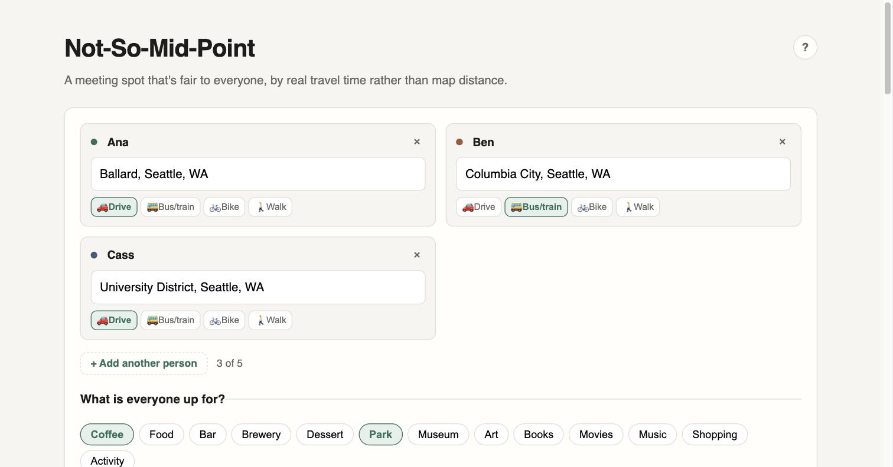
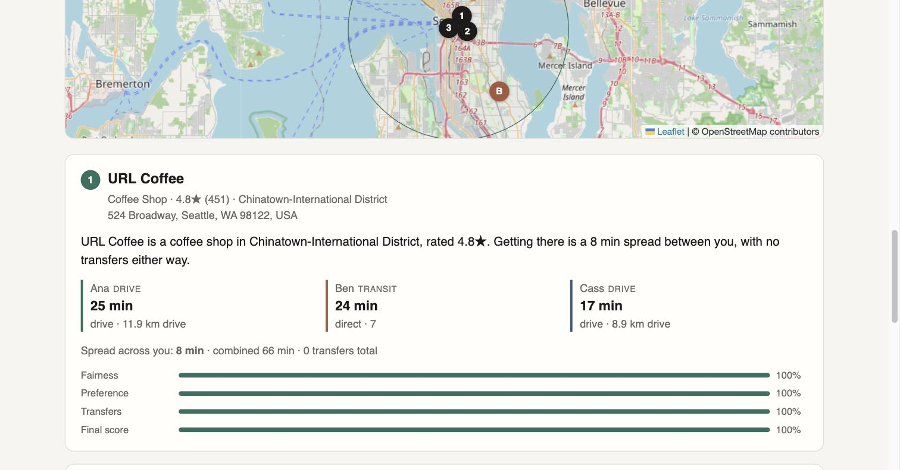

# Not-So-Mid-Point

**Find a meeting spot that's actually fair to everyone.**

Two to five people, scattered starting points, and the perennial question of
where to meet. The usual answer, picking something "in the middle", quietly
favours whoever has the better transit connection. Not-So-Mid-Point measures
what each journey really costs, in travel time and transfers, then finds places
that are fair on those counts *and* somewhere the group actually wants to be.

It does not compute a geographic midpoint. It asks Google what each person's
trip to each candidate area actually takes, and optimises from there.

---

## What it looks like

Three people meeting for coffee or a park: Ana driving from Ballard, Ben on the
bus from Columbia City, Cass driving from the U District.



Every answer shows its work. The map marks where each person starts, by their
initials in their own colour, alongside the three ranked spots. Each suggestion
then breaks down what the trip actually costs every person, and how the spot
scored on each component.



---

## What it does

Give it everyone's addresses and what the group is up for. It returns three
ranked suggestions, each showing every journey in full:

```
1. Storyville Coffee Pike Place · Belltown
   Ana    40 min   transit    D Line
   Ben    19 min   drive      9.6 km
   Cleo   42 min   walk       2.9 km
   Dev    36 min   bike       9.5 km
   Spread across you: 22 min · combined 137 min
```

- **Two to five people.** Add and remove participants freely; the fairness maths
  generalises rather than special-casing pairs. Everyone starts as Person A, B,
  C… and can be renamed. The names carry through to the results and the map.
- **Per-person travel modes**: drive, bus/train, bike, or walk, chosen
  independently. A driver and a rider meeting in the middle land somewhere quite
  different from two riders.
- **Two definitions of fair**, as an explicit toggle: minimise the *spread*
  between the best- and worst-off person, or minimise the *total*. They give genuinely different answers,
  and the choice is yours rather than buried in a scoring function. It starts on
  spread for two people and on total for three or more, where holding the spread
  even tends to drag everyone toward a middle nobody chose.
- **Adjustable priorities**: fairness, preference match, and transfer count, as
  sliders that always total 100%.
- **Interest matching**: pick categories, or just describe what you want
  ("running trail", "somewhere quiet with outdoor seating").
- **Hard limits**: maximum travel time and, when someone's on transit, maximum
  transfers.
- **Address autocomplete** so "Fremont" doesn't silently resolve to California.
- **Honest failure.** When nothing fits, it tells you what to relax: *"Try to
  raise the travel time limit to about 45 min (closest option: Belltown)."*
- **A help dialog** (the `?`, top right) explaining what the tool does and how
  fairness and ranking are calculated, without leaving the page.

Seeded with ~50 Seattle-area neighbourhoods; elsewhere it falls back to sampling
and reverse geocoding.

---

## How it works

Six specialised nodes in a LangGraph state graph. The two reachability nodes run
concurrently. That parallelism is why this is a graph and not a loop.

```
Node 0  transit-aware search area
   ├─ reach_person1 ─┐
   ├─ …              ├─ Node C  shortlist + fairness
   └─ reach_person5 ─┘     → Node D  venue discovery
                           → Node E  scoring
                           → Node F  validation → top 3
```

There is a static reachability node per party slot, so all of them run in a
single superstep however many people are involved; unused slots return
immediately.

**[METHODOLOGY.md](METHODOLOGY.md) documents the algorithm in full**: the
corridor geometry, both fairness functions and why the ceiling constant is 0.4,
the Bayesian rating shrinkage, and why the scoring uses absolute scales rather
than min–max normalisation.

---

## Quick start

Requires Python 3.10+ (LangGraph) and a Google Maps Platform key.

```bash
python3.12 -m venv .venv
.venv/bin/pip install -r backend/requirements-dev.txt
cp backend/.env.example backend/.env      # add your key
cd backend && ../.venv/bin/python -m uvicorn app.main:app --reload
```

Open http://127.0.0.1:8000.

### API keys

`GOOGLE_MAPS_API_KEY` needs these APIs enabled, and **billing active on the
project**, because Maps rejects every request without it:

| API | Used by |
|---|---|
| Geocoding | resolving typed addresses |
| Distance Matrix | Node 0's corridor sweep |
| Directions | Nodes A/B: travel time *and* transfer counts |
| Places API (**New**) | venue search, autocomplete, place details |

Places API **(New)** is a separate product from the legacy "Places API" with a
nearly identical name in the console. The legacy one will not work.

`ANTHROPIC_API_KEY` is optional. Without it, free-text preferences go straight to
Places text search and the explanations come from templates. With it, Claude
expands your description into search types and re-ranks results by fit.

---

## Costs

**$0 for a repeat**, because responses cache for 24 hours, so adjusting sliders on
the same group is free. A cold search costs about **$0.43** (2 people, categories)
or **$0.60** with free text.

The binding constraint is **Places Search Enterprise**: requesting `rating` and
`userRatingCount` puts every venue search in the Enterprise SKU, which allows
**1,000 calls/month free** rather than Pro's 5,000. Ranking on Google ratings is
core to the scoring, so this is not avoidable, only tuneable.

Nearby Search and Text Search are **separate SKUs with separate 1,000/month
allowances**, so using free text does not halve your capacity.

| SKU | Per search | Free/month |
|---|---:|---:|
| Places Nearby/Text **Enterprise** | 3–4 (double with free text) | **1,000** |
| Distance Matrix (elements) | N × 16 | 10,000 |
| Directions | N × 8 | 10,000 |
| Geocoding / Place Details | N | 10,000 |

`NEIGHBOURHOODS_SEARCHED` (3) is the main dial: it sets the Places calls per
search, and therefore how many searches fit inside the free tier. At 3 it is
about 8 searches/day; at 5 it was 6.5, and under 4 with free text.

`GLOBAL_RECOMMEND_PER_DAY` (8) bounds the bill in the app, and fails cleanly with
a 429 before spending anything. The console quotas below are the hard backstop.

## Deploying

GitHub Pages will not work: it serves static files only, and this needs a Python
process. It would also force the Maps key into client-side JavaScript, which is
exactly what the autocomplete proxy exists to avoid.

[`render.yaml`](render.yaml) is a ready blueprint. In Render: **New > Blueprint**,
point it at this repo, and paste `GOOGLE_MAPS_API_KEY` when prompted. Both keys
are marked `sync: false`, so they are entered in Render rather than committed.

Two deployment details worth knowing:

- **One worker, deliberately.** The rate limiter keeps counters in process
  memory, so a second worker would silently double every limit.
- **The free plan sleeps.** After inactivity the first request takes ~50s to
  wake the instance. Subsequent searches are normal speed.
- **The free plan's edge drops requests.** Measured at ~7% on Render free:
  the router answers `404` with `x-render-routing: no-server` and the request
  never reaches the instance. The app is not restarting when this happens; the
  in-memory counters at `/api/stats` hold steady through it. The frontend
  retries these (they cost nothing, having never arrived), but a paid instance
  is the real fix if it becomes noticeable.

### Before making it public

A public URL puts every search on your card. At roughly $0.41 a cold search
against ~312 free per month, an idle loop drains the free tier in minutes.

The blueprint enables rate limiting by default:

| Limit | Default | Purpose |
|---|---|---|
| `RECOMMEND_PER_HOUR` | 12 | one visitor hammering the expensive path |
| `RECOMMEND_PER_DAY` | 40 | slower-burn abuse from one visitor |
| `AUTOCOMPLETE_PER_MINUTE` | 60 | typing is cheap, so this is loose |
| `GLOBAL_RECOMMEND_PER_DAY` | **8** | **the ceiling that actually bounds the bill** |

Set these quotas in the Google console as the hard backstop (free tier ÷ 31):

| API | Quota row | Per day | Per minute |
|---|---|---:|---:|
| Directions | Requests | 322 | 120 |
| Distance Matrix | Elements | 322 | 240 |
| Places API (New) | `SearchNearbyRequest` | **32** | 12 |
| Places API (New) | `SearchTextRequest` | **32** | 12 |
| Places API (New) | `GetPlaceRequest` | 322 | 30 |
| Places API (New) | `AutocompletePlacesRequest` | 322 | 120 |
| Geocoding | **v3** requests | 322 | 30 |

Places API (New) exposes a **separate quota row per operation**, so the two
Enterprise-billed searches can be capped tightly without throttling the
typeahead. 32/day on each keeps both inside their 1,000/month allowances.

Geocoding lists v3 and v4 rows; this app calls the v3 endpoint
(`maps/api/geocode/json`), so the v4 GeocodeAddress/Location/Place rows are
unused and can be left alone or set low.

Per-day caps are free tier ÷ 31, so they hard-stop before you are billed.

Per-minute values must clear **one search's burst**, because the graph fans out
concurrently and a whole search lands inside a single minute. A five-person
search fires 40 Directions calls and 80 Distance Matrix elements at once, so a
per-minute cap below those fails the search outright rather than throttling it.
Each per-minute value here allows two to three searches and stays below its own
per-day cap, so the daily limit is the one that binds.

The global cap is the important one. Per-visitor limits do nothing against many
visitors, so it is what bounds the worst case. Rejected requests return `429`
with a `Retry-After` header.

**None of this is the real backstop.** The limiter is per-process and resets on
restart. Set a hard daily quota cap on each API in the Google Cloud console
(**APIs & Services > each API > Quotas**) plus a budget alert. That is enforced
by Google, bills nothing when exceeded, and cannot be restarted away.

## Usage metrics

`GET /api/stats` reports, per day for the last fortnight:

| Field | Meaning |
|---|---|
| `visitors` | distinct people that day |
| `searches_attempted` | every try, including ones that were blocked |
| `searches_ok` / `searches_no_result` | served, versus "nothing fits your limits" |
| `blocked_personal` | someone individually going too fast |
| `blocked_daily_cap` | the instance-wide ceiling, ie. everyone locked out |
| `blocked_pct` | share of attempts that hit a wall |

The two block reasons are kept apart on purpose. `blocked_personal` is one
impatient visitor and needs no action; `blocked_daily_cap` climbing means real
demand is exceeding the free tier, which is the signal for whether paying for
more quota is worth it.

Visitors are counted by a **salted hash of the IP**, truncated to 12 characters.
No addresses, locations or per-person history are stored, and a random per-process
salt means the hashes cannot be correlated with anything else. Set `VISITOR_SALT`
to keep counts stable across restarts, at the cost of that property.

Counters live in memory and reset on restart. Every event is also logged, and the
host retains logs, so the log is the durable record.

## Tests

```bash
cd backend && ../.venv/bin/python -m pytest -q
```

97 tests run against a fake Maps client, so the whole graph, including the
parallel fan-out, every failure mode, and each scoring rule, is exercised
without spending an API call. Most were written as regressions against specific
bugs found in live output; those cases are documented in the methodology.

---

## Layout

```
backend/app/
  graph.py            LangGraph wiring
  state.py            the shared state object
  nodes/              one module per node
  providers/maps.py   Google Maps client, cached and concurrency-limited
  providers/llm.py    Claude calls, optional with fallbacks
  data/seattle.py     seeded neighbourhood centroids
frontend/             form, results, Leaflet map
```

`GET /api/health` reports which keys are configured.
`GET /api/stats` reports usage and how often people are hit by limits.
`POST /api/recommend` runs the graph.
`POST /api/places/autocomplete` backs the address fields.

---

## Not in v1

No accounts or saved history. Five participants maximum. Scheduled transit data
rather than live disruptions. Web only.
